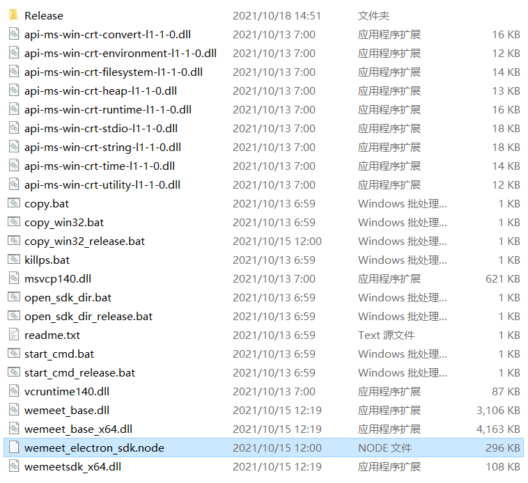
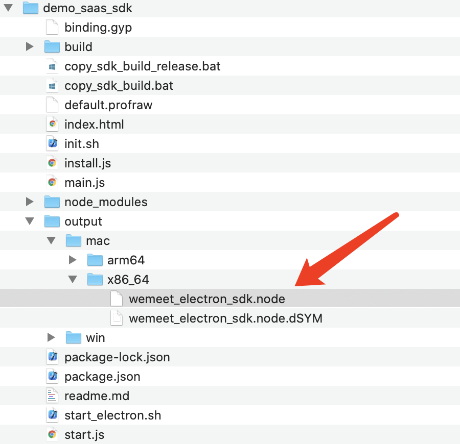
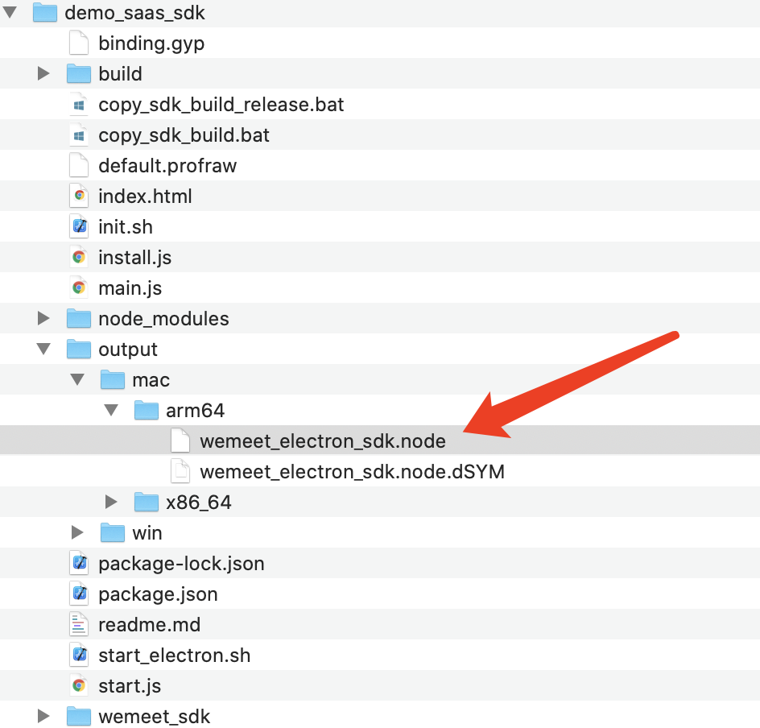
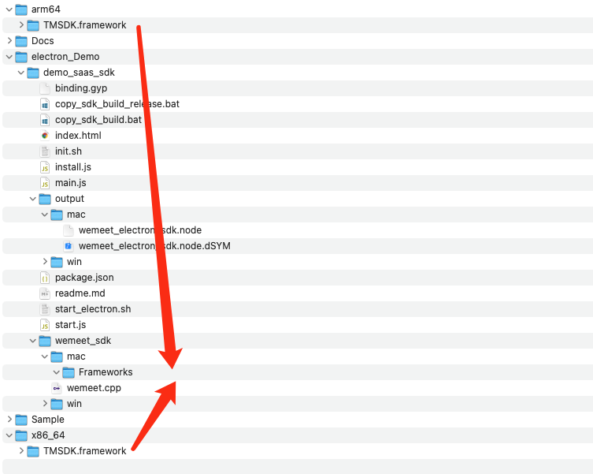
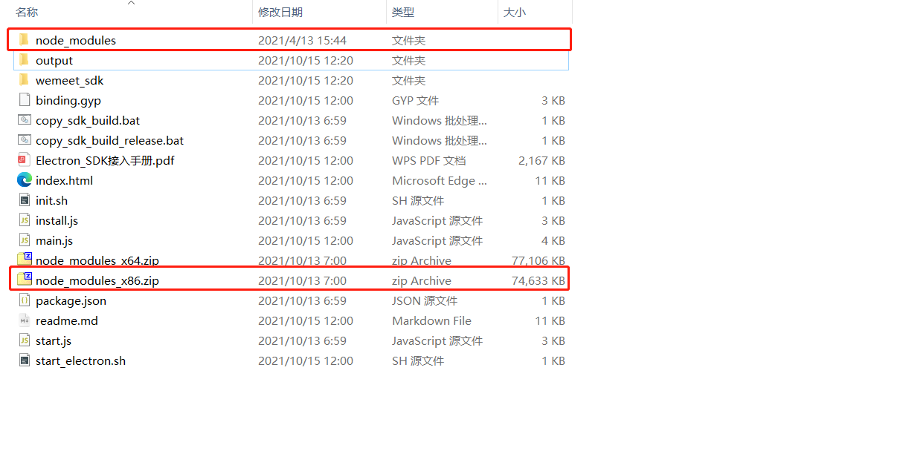
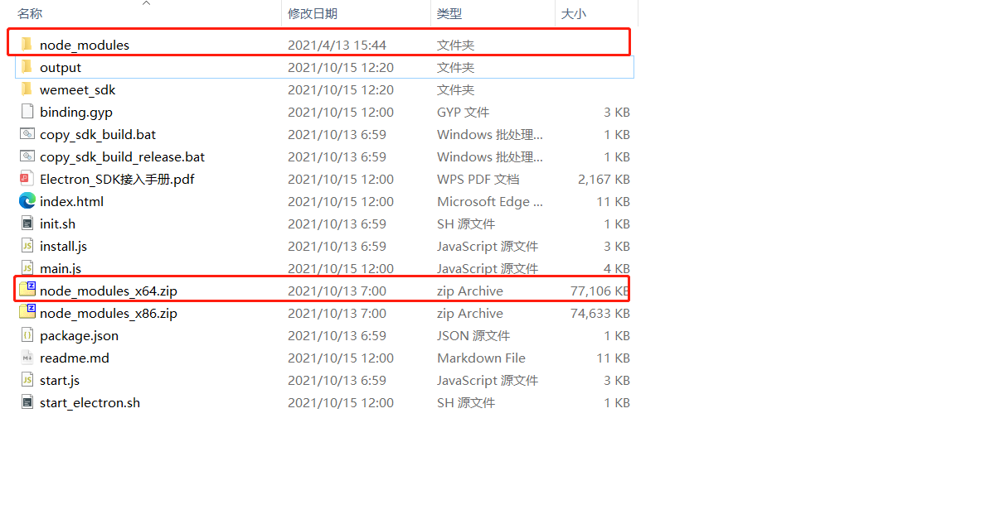

# Electron 接入手册

## 1. demo环境配置说明
### 1.1 环境要求
1. 操作系统：win7与win10的32位和64位，MacOS
2. nodejs

### 1.2 文件说明
为了简化 electron 的接入，我们封装了一个 node.js 的 addon，可以在 electron 中直接导入这个
addon，使用里面封装的接口即可。
这个 nodejs 的 addon 的名字是 wemeet_electron_sdk.node, windows 和 mac 都是这个名字

#### 1.2.1 Win32环境node文件


#### 1.2.2 Win64环境node文件


#### 1.2.3 Mac位环境node文件



#### 1.2.4 Mac SDK 文件



> **说明：在windows和mac上wemeet_electron_sdk.node的依赖文件是不一样的，但是我们提供的 .node 文件导出的接口是一致的，所以编码接入的时候无需平台的差异性，打包的时候将对应平台的依赖文件对应目录即可。**

### 1.3 运行demo

运行demo需要配置对应平台的环境，根据下面的指引各自配置环境。

#### 1.3.1 32位 Windows
**一、拷贝SDK**

- 方法一：将文件说明中的windows SDK目录下Release的所有内容拷贝到output/win/win32/Release目录下，把wemeet_base.dll和wemeetsdk_x86.dll拷贝到output/win/win32/下。

- 方法二:  直接执行output/win/win32/copy_win32_release.bat(bat文件中的内容也就是做了方法1的操作，写成了脚本)

**二、安装electron以及相关的依赖**

- 方法一：Electron_Demo目录下执行npm install安装依赖
- 方法二：Windows内置了npm依赖包可以直接解压，解压node_modules_x86.zip到当前目录，得到32位windows node环境依赖node_modules目录



**三、运行demo**

Electron_Demo目录下执行npm start


#### 1.3.2 64位 Windows

**一、拷贝SDK**

- 方法一：将文件说明中的windows SDK目录下Release的所有内容拷贝到output/win/x64/Release目录下，把wemeet_base_x64.dll和wemeetsdk_x64.dll拷贝到output/win/x64/下。

- 方法二:  直接执行output/win/x64/copy_win32_release.bat(bat文件中的内容也就是做了方法1的操作，写成了脚本)

**二、安装electron以及相关的依赖**

- 方法一：Electron_Demo目录下执行npm install安装依赖

- 方法二：Windows内置了npm依赖包可以直接解压，解压node_modules_x64.zip到当前目录，得到64位windows node环境依赖node_modules目录


**三、运行demo**

Electron_Demo目录下执行npm start


#### 1.3.3 Mac 环境

1. 在demo_saas_sdk文件夹下启用终端，执行start_electron.sh脚本。 x86_64环境下在终端输入，arm64环境下在终端输入bash start_electron.sh arm64。
2. 执行完脚本后，等待即可，无报错情况下会自动打开demo。
3. 执行成功过一次脚本后，再次运行demo可输入“npm start”指令或再次执行脚本。


## 2. SDK 接入说明
### 2.1 申请 SDK Id & SDK Secret

为了让SDK 正常使用，需要为 SDK 配置独有的安全凭证，安全凭证包括 SDK Id 和SDK Secret ，对每一次请求进行验证。联系腾讯会议商务对接人进行信息登记进行 SDK。

### 2.2 SDK 接入环境配置

#### 2.2.1 32位 Windows

一. 安装32位的nodejs，安装electron

二. 新建electron工程

三. 在package.json加配置

javascript

```javascript
"scripts": {
  "start": "node start.js && electron ."
},
```

四. 拷贝SDK文件，参考章节 1.3.1：

五. 在js中导入 的wemeet_electron_sdk.node 文件

```javascript
// path_to_your_wemeet_electron_sdk.node 表示 wemeet_electron_sdk.node的路径
const wemeet_sdk = require('path_to_your_wemeet_electron_sdk.node')
// 这里导入的 wemeet_sdk 会在接下来的接口说明中使用
```

目录结构如下：



**注意，要保证`Release`目录已经拷贝到`wemeet_electron_sdk.node`的的同级目录下**

#### 2.2.2 64位 Windows

一. 安装64位的nodejs，安装electron

二. 新建electron工程

三. 在package.json加配置

javascript

```javascript
"scripts": {
  "start": "node start.js && electron ."
},
```

四. 拷贝SDK文件，参考章节 1.3.2：

五. 在js中导入 的wemeet_electron_sdk.node 文件

```javascript
// path_to_your_wemeet_electron_sdk.node 表示 wemeet_electron_sdk.node的路径
const wemeet_sdk = require('path_to_your_wemeet_electron_sdk.node')
// 这里导入的 wemeet_sdk 会在接下来的接口说明中使用
```

目录结构如下：


**注意，要保证`Release`目录已经拷贝到`wemeet_electron_sdk.node`的的同级目录下**

#### 2.2.3 Mac 环境

一. 安装nodejs，安装electron

二. 新建electron工程

三. 将wemeet_electron_sdk.node拷贝到 `output/Mac`目录下。

四. 在package.json加配置

```javascript
"scripts": {
  "start": "node start.js && electron ."
}
```

五. 修改start.js，拷贝SDK文件，参考demo的start.js：

Mac端：将SDK文件（即TMSDK.framework）拷贝至node_modules/electron/dist/xxx.app/Contents/Frameworks目录下

六. 在js中导入 wemeet_electron_sdk.node 文件

```javascript
// path_to_your_wemeet_electron_sdk.node 表示 wemeet_electron_sdk.node的路径
const wemeet_sdk = require('path_to_your_wemeet_electron_sdk.node')
// 这里导入的 wemeet_sdk 会在接下来的接口说明中使用
```

## 3. 接口说明

> 注意：接口调用是异步过程，需要在对应的回调中处理接口调用的结果，其中**InitWemeetSDK**初始化的操作必须要等到该接口的回调之后再进行其他的接口调用，否则其他的接口调用都是无效的

本文档只列出接口的名称和参数，具体参数说明可以参考《TencentMeetingSDK（TMSDK）接口参考文档》

### 1、初始化 SDK

```
windows端：wemeet_sdk.InitWemeetSDK(sdk_id, sdk_token, data_path, app_name, app_icon);
mac端：wemeet_sdk.InitWemeetSDK(sdk_id, sdk_token, data_path, app_name);
```

### 2、登录

``` 
wemeet_sdk.Login(sso_url);
```

### 3、入会

``` 
wemeet_sdk.JoinMeeting(meeting_code, user_display_name, password, mic_on, camera_on, speaker_on, face_beauty_on)
```

### 4、显示home界面

``` 
wemeet_sdk.GoToHomeView();
```

### 5、登出

``` 
wemeet_sdk.Logout();
```

### 6、退出会议

```  
wemeet_sdk.LeaveMeeting(end_meeting)
```

### 7、会议信息回调开关

``` 
wemeet_sdk.SetNeedShareCallback(invite_on, invite_show)
```

#### 8、邀请回调开关

```
wemeet_sdk.SetNeedMeetingInfoCallback(info_on, info_show)
```

#### 9、无线投屏

```
wemeet_sdk.ScreenCasting()
```

#### 10、打开日志目录

```
wemeet_sdk.OpenLogDirectory()
```

#### 11、检查登录态

```
wemeet_sdk.IsAuthorized()
```

#### 12、显示会议历史

```
wemeet_sdk.ShowHistoricalMeetingView();
```

#### 13、显示会议详情

```
wemeet_sdk.ShowMeetingDetailView(meeting_id, current_sub_meeting_id)
```

#### 14、登录态跳转

```
wemeet_sdk.JumpUrlWithLoginStatus(target_url)
```

#### 15、反初始化

```
wemeet_sdk.ReleaseWemeetSDK()
```

#### 16、添加js回调

```
wemeet_sdk.AddJsCallback(call_back)
```

说明：这个函数是electron的sdk独有的函数，call_back 是一个js的function，参数是一个json字符串

## 4. 回调说明

所有接口的调用接口都是通过异步回调返回的，这里异步回调的返回值是一个标准的json字符串，格式如下：

| Key   | 类型   | 说明                                    |
| ----- | ------ | --------------------------------------- |
| func  | string | 回调对应的调用函数名称，回调的标识      |
| code  | int    | 回调错误码，0为正常                     |
| msg   | string | 详细的错误信息                          |
| param | string | 回调需要带回的数据，也是一个json object |

回调的具体类别和参数在这里不作详细的罗列，可以参考《TencentMeetingSDK（TMSDK）接口参考文档》

