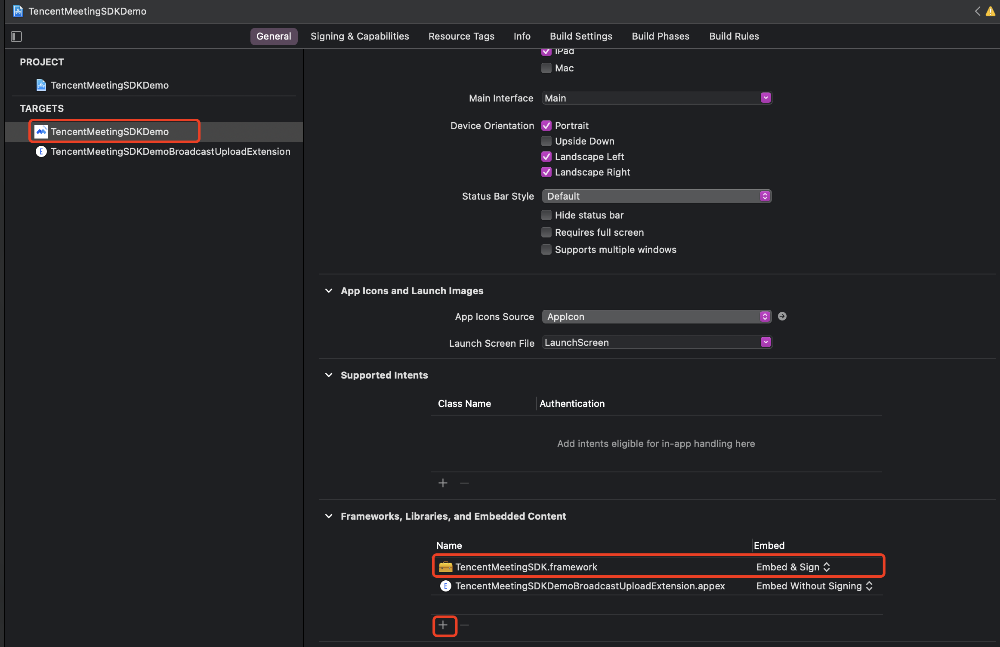
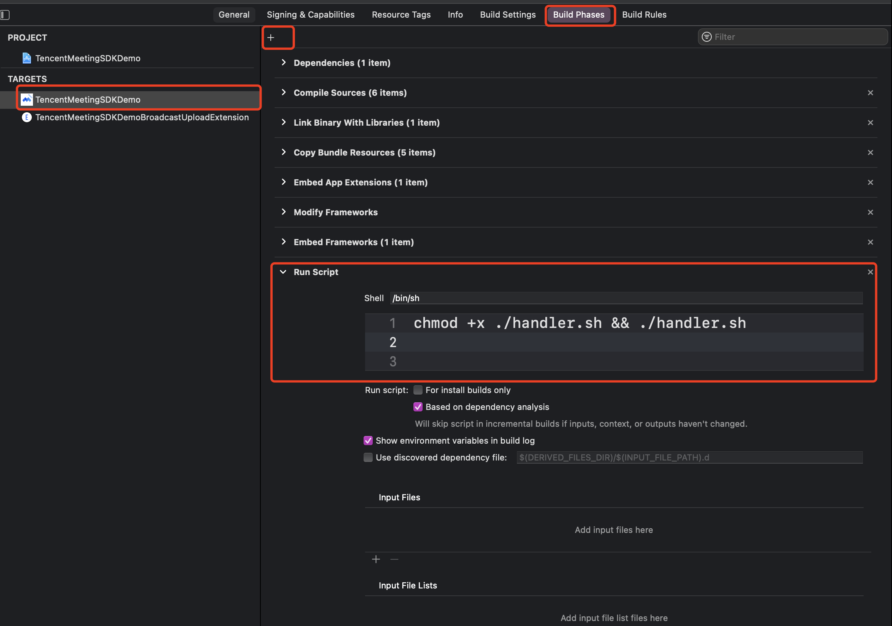
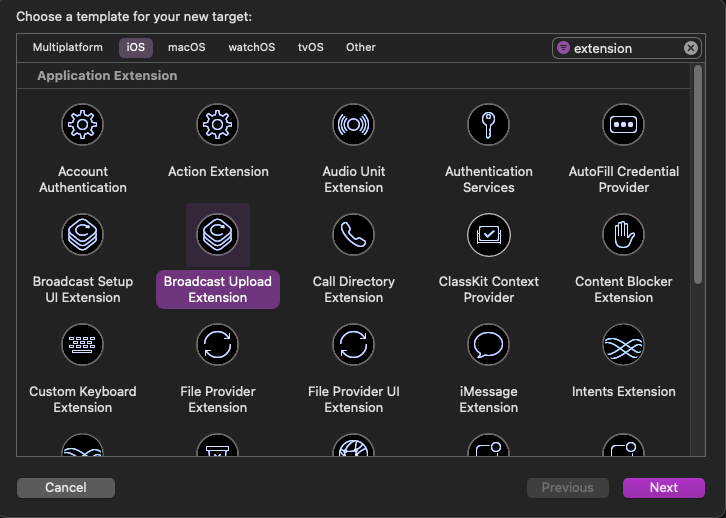
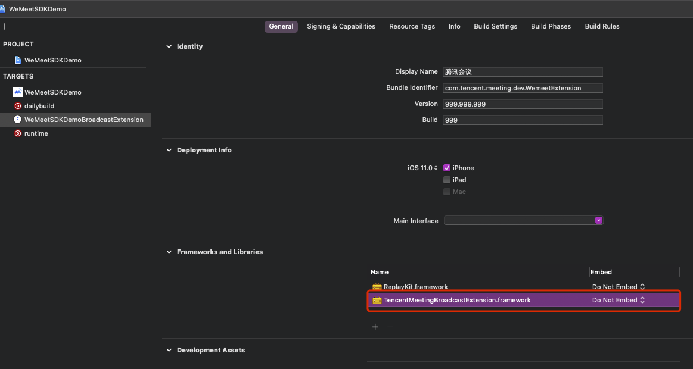

# Demo使用

## 1. 获取SDK
请联系售后人员获得SDK

## 2. 打开Demo工程
打开Demo/TencentMeetingSDKDemo.xcodeproj
## 3. 配置SDK账号

在Demo工程中对应源码配置SDK Id、SDK Token、SSO Url，账号信息可以联系腾讯会议工作人员；

| 配置      | Demo源码               |      |
| --------- | ---------------------- | ---- |
| SDK Id    |  ViewController+Init.m  |      |
| SDK Token |  ViewController+Init.m  |      |
| SSO Url   |  ViewController+Login.m |      |

## 4. 配置开发者账号

去苹果开发者网站，配置开发者账号，需要配置SDK Demo和SDK Demo屏幕共享扩展两个Identifiers，权限Access WiFi Infomation；

注意(因为主App启动屏幕共享扩展的需要根据扩展的Bundle Id来觉得启动那个扩展)：
SDK Demo的bundle id为XXX.XXX.XXX
SDK Demo屏幕共享扩展的bundle id规定为XXX.XXX.XXX.WemeetExtension

## 5. Xcode点击运行

# SDK接入

## 1. 环境版本提示

+ SDK版本：V2.18
+ 支持 iOS 10.0+
+ 屏幕共享扩展支持 iOS 12.0+

## 2. 工程配置framework

在App的主工程的主target中添加TencentMeetingSDK.framework，设置Embed为Embed & Sign；



在App的主工程的主target中Build Phases中添加New Run Script Phase



新添加的Phase要在Embed Frameworks后面，添加以下脚本

```
chmod +x ./handler.sh && ./handler.sh
```

handlers.sh脚本在Demo中有一份，handlers.sh脚本要跟xcodeproj文件放在一个目录下，handler.sh内容为

```
PRODUCTS_DIR=${TARGET_BUILD_DIR}/${WRAPPER_NAME}
TencentMeetingSDKFrameworksPath=${PRODUCTS_DIR}/Frameworks/TencentMeetingSDK.framework/Frameworks

# resign Frameworks
function resign_embed_frameworks(){
  for f in $(find ${1} -name '*.framework')
  do
    codesign --force --sign "${EXPANDED_CODE_SIGN_IDENTITY}" --preserve-metadata=identifier,entitlements --timestamp=none "$f"
    if [ -d ${f}/'Frameworks' ]; then
      resign_embed_frameworks ${f}/'Frameworks'
    fi
  done
}

# copy to
if [[ -d ${TencentMeetingSDKFrameworksPath} ]]; then
  cp -r ${TencentMeetingSDKFrameworksPath}/* ${PRODUCTS_DIR}/Frameworks
  rm -rf ${TencentMeetingSDKFrameworksPath}
  resign_embed_frameworks ${PRODUCTS_DIR}
fi
```

## 3. 初始化

````
- (void)SDKInit:(NSString *)SDKId SDKToken:(NSString *)SDKToken {
    TMInitParam* initParams = [TMInitParam new];
    initParams.sdkId = SDKId;
    initParams.sdkToken = SDKToken;
    [self startAnimation];
    [[TencentMeetingSDK instance] initialize:initParams delegate:self];
}

#pragma mark - TMSDKProtocol
- (void)onSDKInitializeResult:(TMSDKResult)code msg:(NSString *)msg; {
    NSLog(@"SDK init complete, code is %ld", code);
    [self stopAnimation];
    if (code == kSDKErrorSuccess) {
        self.setupButton.enabled = NO;
    }
}

````

## 4.登录和登出

```

- (void)login:(NSString *)SSOUrl forceKickOtherDevice:(BOOL)forceKickOtherDevice {
    [self startAnimation];
    [[[TencentMeetingSDK instance] getAccountService] setDelegate:self];
    [[[TencentMeetingSDK instance] getAccountService] login:SSOUrl forceKickOtherDevice:forceKickOtherDevice];
}

- (void)logout {
    [self startAnimation];
    [[[TencentMeetingSDK instance] getAccountService] logout];
}

#pragma mark - TMAuthenticationProtocol
- (void)onLogin:(TMSDKResult)code msg:(NSString *)msg {
    NSLog(@"SDK login complete, code is %ld", (long)code);
    [self stopAnimation];
    [self showAlert:[NSString stringWithFormat:@"SDK login complete, code is %ld", (long)code]];
    if (code == kSDKErrorSuccess) {
        self.loginButton.enabled = NO;
        self.logoutButton.enabled = YES;
    }
}

- (void)onLogout:(TMLogoutType)type code:(TMSDKResult)code msg:(NSString *)msg {
    NSLog(@"SDK logout complete, type is %ld, code is %ld", type, (long)code);
    [self stopAnimation];
    [self showAlert:[NSString stringWithFormat:@"SDK logout complete, type is %ld, code is %ld", type, (long)code]];
    if (code == kSDKErrorSuccess) {
        self.loginButton.enabled = YES;
        self.logoutButton.enabled = NO;
    }
}

```

## 5. 入会和离会

```
- (void)joinMeeting:(NSArray<UITextField *> *)textFields {
    TMJoinParam *joinParam = [TMJoinParam new];
    joinParam.meetingCode = textFields[0].text;
    joinParam.userDisplayName = textFields[1].text;
    joinParam.password = textFields[2].text;
    joinParam.inviteUrl = textFields[3].text;
    joinParam.cameraOn = [self switchOn:textFields[4]];
    joinParam.micOn = [self switchOn:textFields[5]];
    joinParam.speakerOn = [self switchOn:textFields[6]];
    joinParam.faceBeautyOn = [self switchOn:textFields[7]];
    [[[TencentMeetingSDK instance] getPreMeetingService] joinMeeting:joinParam];
}

- (void)leaveMeeting:(NSArray<UITextField *> *)textFields {
    BOOL endMeeting = [self switchOn:textFields[0]];
    [[[TencentMeetingSDK instance] getInMeetingService] leaveMeeting:endMeeting];
}

#pragma mark - TMPreMeetingProtocol
- (void)onJoinMeeting:(TMSDKResult)code msg:(NSString *)msg meetingCode:(NSString *)meetingCode {
    NSLog(@"SDK join complete, code is %ld, msg is %@, meetingCode is %@", (long)code, msg, meetingCode);
    if (code != kSDKErrorSuccess) {
        [self showAlert:[NSString stringWithFormat:@"SDK join complete, code is %ld, msg is %@, meetingCode is %@", (long)code, msg, meetingCode]];
    }
}

#pragma mark - TMInMeetingProtocol
- (void)onLeaveMeeting:(TMLeaveType)type code:(TMSDKResult)code msg:(NSString *)msg meetingCode:(NSString *)meetingCode {
    NSLog(@"SDK leave complete, type is %ld, code is %ld, meetingCode is %@", (long)type, (long)code, meetingCode);
    if (code != kSDKErrorSuccess) {
        [self showAlert:[NSString stringWithFormat:@"SDK leave complete, type is %ld, code is %ld, meetingCode is %@", (long)type, (long)code, meetingCode]];
    }
}
```

## 6. 屏幕共享扩展接入

- 新建Broadcast Upload Extesion，注意最低支持iOS版本为iOS 12.0


- 设置屏幕共享扩展依赖TencentMeetingBroadcastExtension.framework，主页Embed设置为Do Not Embed



- 从Demo中将SampleHandler.m和SampleHandler.h复制过来

- 运行，点击屏幕共享


# 更多功能
请参考《TencentMeetingSDK（TMSDK）接口参考》文档

